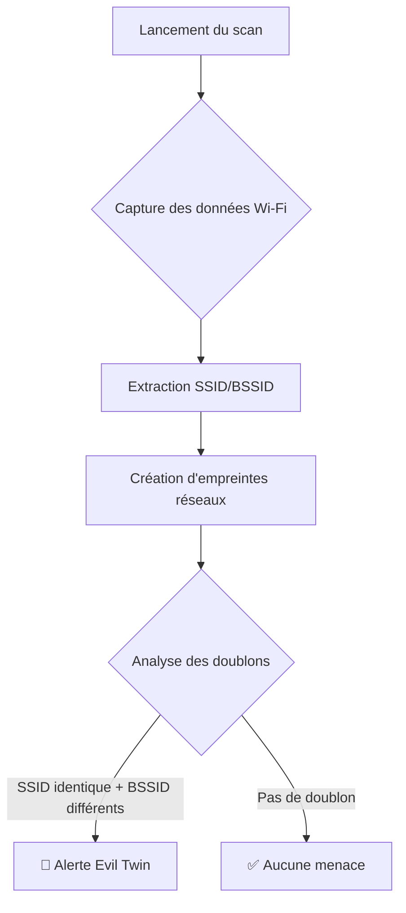

# detect_evil_twin.py

### Détecteur Evil Twin - Wi-Fi Security Scanner**  
Version : 1.2 | **Langue :** Python 3 | **Plateforme :** Linux  

---

#### 🔍 **Description**  
Ce script détecte les attaques "Evil Twin" en analysant les réseaux Wi-Fi environnants. Il identifie les réseaux malveillants qui usurpent l'identité de points d'accès légitiques en comparant les signatures techniques (SSID/BSSID) sur deux scans successifs.  

⚠️ **Objectif éthique** :  
- Tester la sécurité de vos propres réseaux  
- Sensibiliser aux risques des Wi-Fi publics  

---

#### ⚙️ **Fonctionnement Technique**  


---

#### 📋 **Fonctionnalités Clés**  
- **Double vérification** : Scans à 10s d'intervalle pour éviter les faux positifs  
- **Détection avancée** :  
  - Analyse des adresses MAC (BSSID)  
  - Comparaison des signatures SSID  
- **Sortie claire** :  
  - Alertes colorées (rouge/vert)  
  - Explications techniques intégrées  

---

#### 🛠️ **Prérequis & Usage**  
**1. Préparation :**  
```bash
sudo airmon-ng start wlan0  # Activation du mode moniteur
```

**2. Exécution :**  
```bash
chmod +x evil_twin_detector.py
sudo ./evil_twin_detector.py
```

**3. Exemple de sortie :**  
```plaintext
🚨 ATTENTION : Evil Twin détecté !
- ALERTE : 'FreeWifi' a 2 routeurs différents (BSSID : AA:BB:CC:11:22:33, DD:EE:FF:44:55:66)
```

---

#### ⚠️ **Avertissements**  
1. Nécessite les droits **root** (accès matériel Wi-Fi)  
2. Fonctionne **uniquement sur Linux** avec :  
   - Paquet `wireless-tools` (`iwlist`)  
   - Interface en mode moniteur  
3. Ne pas utiliser à des fins malveillantes  

---

#### 📚 **Contexte Technique**  
> Un "Evil Twin" est un point d'accès pirate qui clone un réseau légitime (même nom SSID) mais utilise une adresse MAC (BSSID) différente. Cette attaque permet d'intercepter le trafic des utilisateurs trompés.

---

#### 📝 **Code Structure**  
```python
# 1. Scan Wi-Fi avec iwlist
def scan_wifi()

# 2. Extraction SSID/BSSID via RegEx
def detect_evil_twin()

# 3. Scans comparés + Alerte
if __name__ == "__main__":
    first_scan = ... 
    second_scan = ...
    alerts = set(first_scan) & set(second_scan)
```

---

#### 📌 **Best Practices**  
- Déconnectez-vous immédiatement en cas d'alerte  
- Signalez les réseaux suspects à votre service IT  
- Évitez les transactions sensibles sur Wi-Fi publics  

> ⚖️ **Disclaimer légal** : Cet outil est fourni à des fins éducatives uniquement. L'utilisation non autorisée est interdite.
